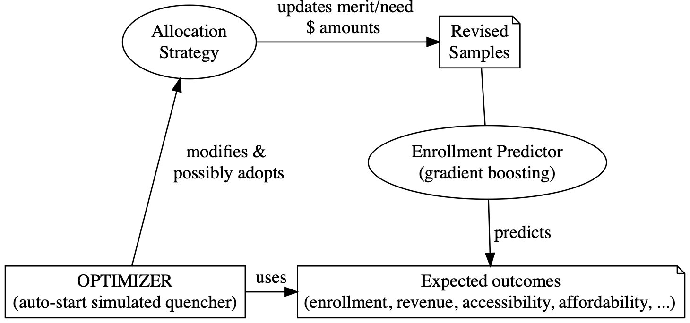

The allocation of aid and award is critical to budget mangagement of higher education institutitions. It is also important for prospective students, who face with rapidly increasing costs of higher ed.

This work optimizes the distribution of need-based aid and merit-based awards to accepted students at universities.

The technical approach is a unique type of reinforcement learning, in which the features (i.e. strategies for allocating aid and awards) are continually updated throughout the optimization process.  Better strategies result in higher expected enrollment and revenues for the universities, and/or higher affordability and accessibility for students.   

Good strategies are rewarded through the optimization process, which eventually leads to a strategy that meets the expectations and constraints of the institutitions.

